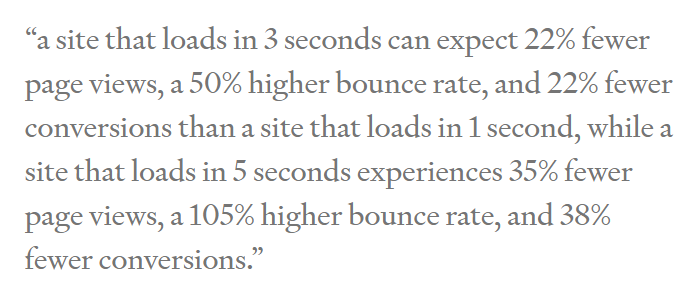

# arcgis-core-vs-esri-loader

This repository is meant to show different patterns for loading the [ArcGIS JavaScript API](https://developers.arcgis.com/javascript/latest/) and the pros and cons of each method.

This compares using:

* [esri-loader](https://github.com/Esri/esri-loader)
* [@arcgis/core](https://www.npmjs.com/package/@arcgis/core)


## `esri-loader`

The `esri-loader` is a nice light weight library that will lazy load any ArcGIS JS API modules by inserting `<script>` tags that make CDN calls to load the necessary modules.  

Pros:

* tiny library
* light weight usage of API
* faster loading due to smaller bundle and usage of cached [CDN](https://www.globaldots.com/content-delivery-network-explained) 

Cons:

* must use AMD loader, which requires using [promises](https://developer.mozilla.org/en-US/docs/Web/JavaScript/Reference/Global_Objects/Promise) or [async/await](https://developer.mozilla.org/en-US/docs/Learn/JavaScript/Asynchronous/Async_await) to load modules and work with them.

## `@arcgis/core`

With the release of the ArcGIS JavaScript API 4.18, I was very exicted to hear that we were finally getting [ES modules](https://developer.mozilla.org/en-US/docs/Web/JavaScript/Guide/Modules) so we could install and import the API with ease.  However, my excitement quickly turned to disappointment when I ran a build and all of a sudden there were 48 MB of JS files and 168 different files being loaded. 

> note: at this time (3/17/2021) this package is still in beta and hopefully will address the cons I have listed below, particularly related to lack of tree shaking.

Pros: 

* easy to install via npm or yarn
* can load modules with `import` statments

Cons:

* absolutely massive bundles, does not yet appear to support [tree shaking](https://developers.google.com/web/fundamentals/performance/optimizing-javascript/tree-shaking)
* must include esri assets in a `public` folder (also quite large)
* slower load time

## The Demo Application

The demo app is a small [Vue.js](https://vuejs.org/) (version 3.x) written in TypeScript that only loads the following 3 modules:

* [esri/conifg](https://developers.arcgis.com/javascript/latest/api-reference/esri-config.html): set the esri configuration options (developer token in this case)
* [esri/Map](https://developers.arcgis.com/javascript/latest/api-reference/esri-Map.html): the esri Map
* [esri/MapView](https://developers.arcgis.com/javascript/latest/api-reference/esri-views-MapView.html): the esri MapView

## Performance Comparisons

### Output Bundle Info (JavaScript files only):

`esri-loader`:

* size: `108 KB` (111,129 bytes)
* number of files: 2


And the full build:


`@arcgis/core`:

* size: `10.3 MB` (10,897,588 bytes)
* number of files: 168


And the full build:

> note: this build also includes `22.2 MB` of esri assets (3,448 files)


In this case, the `esri-loader` is the clear winner in my opinion.  Is it just me or does ~`10 MB` sound like a lot for only using **THREE** modules.  In fact, I'd argue that anything over `5 MB` is probably very inefficient or unnecessarily large.

#### Why does bundle size matter?

Simply put, load time. See this quote from Strangeloop Networks referenced in [this article](https://betterprogramming.pub/reducing-js-bundle-size-58dc39c10f9c):



Also the amount of content being loaded may not matter for desktop applications, but it definitely makes a difference for mobile devices. Mobile devices most often do not have the same compute power and many users have data limitations on their cellular plans.

### Lighthouse Results (mobile, slow network test)

Both the `esri-loader` and `@arcgis/core` both scored very low in Lighthouse Perfomance.  I know loading the ArcGIS JavaScript API can always lead to poor performance due to the initial paint.  This can be improved by displaying something immediately while the map is loading such as splash screen, but there is definitely a noticable difference in speed of using the `esri-loader` vs `@arcgis/core` due to the upfront cost of loading all the extra bundles.


> note: lighthouse mobile results are based on 3G speed.

| Build Type     | Desktop Speed Index | Mobile Speed Index |
|----------------|:-------------------:|:------------------:|
| `esri-loader`  |                     |                    |
| `@arcgis/core` |        13.4 s       |       43.2 s       |


## Project setup
```
npm install
```

### Compiles and hot-reloads for development
```
npm run serve
```

### Compiles and minifies for production
```
npm run build
```

### Lints and fixes files
```
npm run lint
```

### Customize configuration
See [Configuration Reference](https://cli.vuejs.org/config/).
